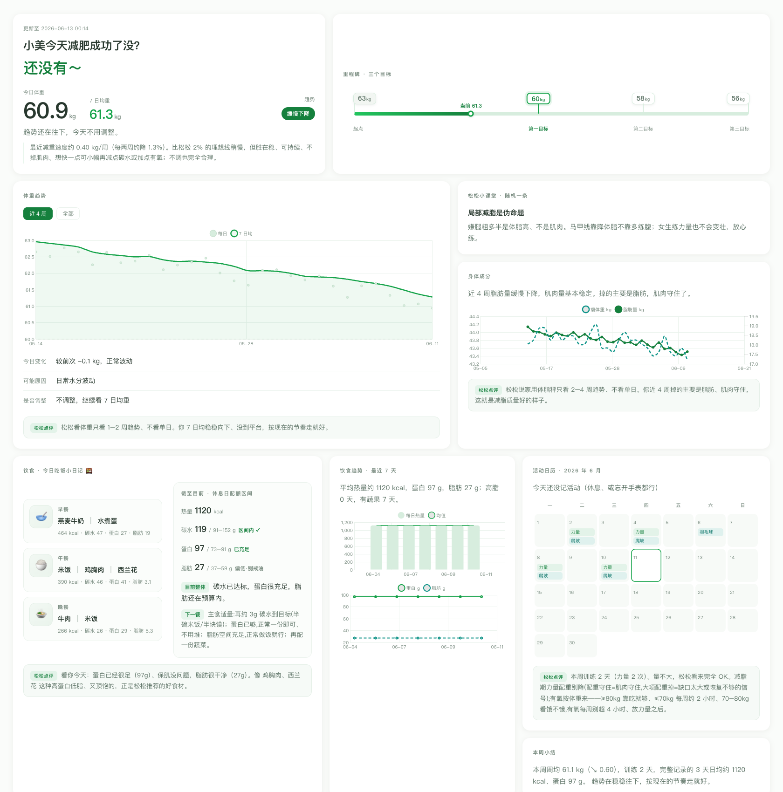

# 掉秤搭子 · cut-buddy

> 基于 B 站「好人松松」减脂方法论的**个人减脂/增肌陪跑搭子**。
> 你用大白话报体重/饮食/运动，它结构化存档、按松松配额给碳蛋脂区间、用「看趋势不看单日」判断你是不是真在变好，并生成一个**本地可视化看板**。**全程本地、不联网。**

这是一个 [Claude Code](https://claude.com/claude-code) **Agent Skill**。

## 看板预览

> 下图为**虚构示例数据**(非真实用户)。



## 安装

把本仓库放到 Claude 的 skills 目录即可：

```bash
git clone https://github.com/AIisNothing/cut-buddy.git ~/.claude/skills/cut-buddy
```

（或直接把文件夹拷到 `~/.claude/skills/cut-buddy/`。）

## 怎么用

装好后，在对话里随口说一句打卡的话就会触发，例如：

- 「早上称了 60.5」「今天吃了俩鸡蛋一个馒头」「练了胸 + 爬坡半小时」
- 「看看我的减脂趋势」「这周怎么样」「我是不是平台期了」

**第一次使用**会引导你建档（怎么称呼你 → 看板标题、目标 → 自动建里程碑、历史体重可从苹果「健康」导入/传截图/直接跳过），然后生成你的本地看板。之后每次记录，看板自动刷新。

## 三大能力

- **📝 随手记录** —— 你说人话，自动记账算碳蛋脂；常吃食物会被记住
- **🧭 科学指导** —— 按 性别 × 阶段（减脂/增肌/维持）给配额区间，大体重（BMI>28/32）自动下调起始配额；7 日均 + 周均看真趋势；平台期排查；附 有氧心率消耗 / 1RM 最大力量 两个小算盘
- **🤝 看板陪伴** —— 本地可视化看板 + 每日夸夸

详见 [PRD.md](./PRD.md)（产品需求文档）/ [PRD.html](./PRD.html)（图文说明书）/ [CHANGELOG.md](./CHANGELOG.md)。

## 数据与隐私

- 所有个人数据存在你本地 `~/Documents/cut-buddy-data/`，**不联网、不上传、不做公开网页**。
- 本仓库**不含任何个人数据**，可放心开源/分发。

## 运行环境

为 **Claude Code** 设计（即装即用、自动触发、可选定时提醒，体验最完整）。引擎是纯 Python 标准库，在其它 agent 上也能跑脚本/出看板，但「自动触发」「定时提醒」可能需要手动配合。

## 致敬

方法论致敬 B 站 UP 主 **好人松松**（碳蛋脂配额、缺口、碳水递减、两周趋势反馈、不掉秤排查）。本工具是其方法论的个人陪跑实现，非官方、不替代专业医疗建议。

## License

MIT
